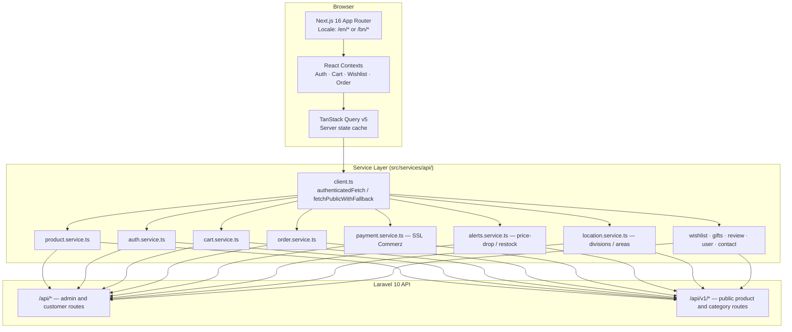
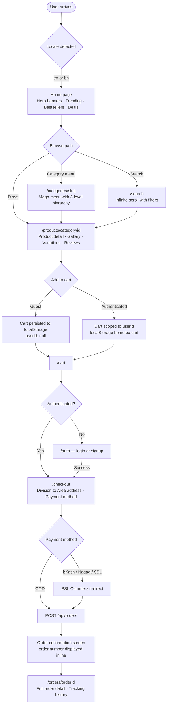
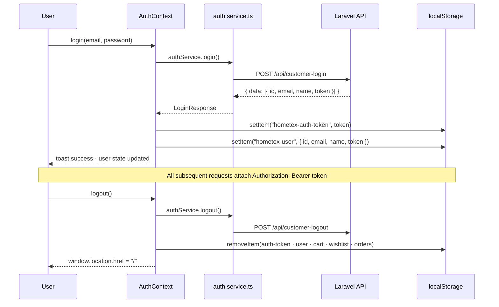
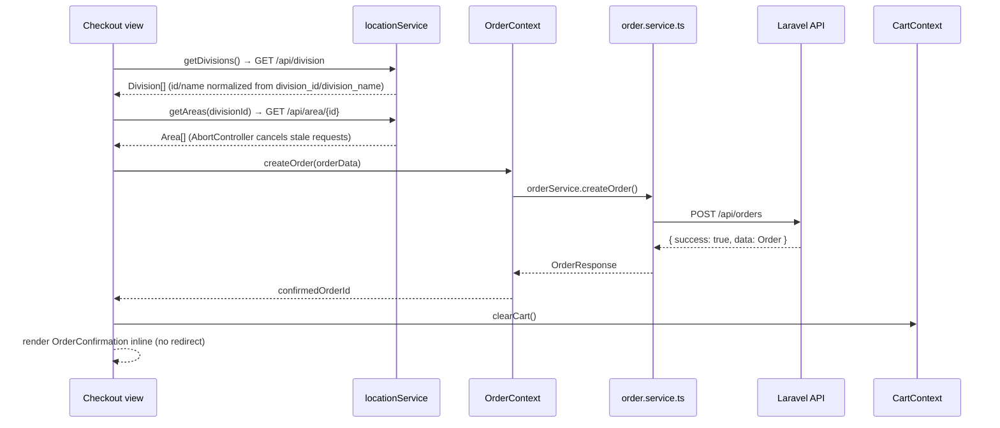

# Hometex Bangladesh — E-Commerce Storefront

Customer-facing storefront for Hometex Bangladesh, a home textile retailer. Built with Next.js 16 App Router, TypeScript, and next-intl. Handles product discovery, cart, checkout, order tracking, and a B2B corporate enquiry flow. Part of a three-project system alongside a Laravel 10 API and a React admin dashboard.

**Related repositories:**
- Backend API: [hometex-api](https://github.com/ShahriarHim/hometex-api) — Laravel 10 + Sanctum, shared by both frontends
- Admin dashboard: [hometex-ims](https://github.com/ShahriarHim/hometex-ims) — Vite + React 18, inventory and POS

---

## The Engineering Problem

Retail frontends in the Bangladesh market face a specific constraint set: slow and inconsistent mobile networks, a customer base that expects both English and Bengali, payment methods that are local (bKash, Nagad, Rocket, SSL Commerz) not global, and an address model based on administrative divisions rather than postal codes. Adding to that: the same backend serves both B2C customers and B2B corporate accounts, and the same API contract must support an IMS admin panel with different auth requirements.

The core engineering challenge was not "build a shopping site." It was: design a clean separation between a shared Laravel API and a Next.js frontend that handles two languages, local payment gateways, a three-level product hierarchy, and server-rendered pages — without coupling the frontend to implementation details of the backend.

---

## System Architecture



---

## User Journey



---

## Auth Flow



---

## Data Flow — Checkout



---

## Tech Stack

| Technology | Version | Why |
|---|---|---|
| Next.js | ^16.0.7 | App Router for co-located server components; `output: "standalone"` for container deploy; `typedRoutes: true` catches broken internal links at compile time |
| TypeScript | ^5.8.3 | End-to-end type safety across 14 service modules and 11 type definition files; catches API contract drift at build time |
| next-intl | ^4.5.5 | Route-based i18n with `[locale]` segment; server-side message loading; typed `useTranslations`; 2 locales (en, bn) |
| TanStack Query | ^5.83.0 | Server state cache with 1-minute stale time; `useInfiniteQuery` for paginated product lists; avoids prop-drilling fetched data |
| Radix UI | 25 primitives | Unstyled, accessible primitives; each primitive imported individually to keep bundle tight |
| Zod | ^3.25.76 | Runtime validation paired with react-hook-form resolvers; validates checkout form data before submission |
| react-hook-form | ^7.61.1 | Uncontrolled form management; combined with Zod resolvers for type-safe form validation |
| Embla Carousel + Swiper | ^8.6.0 / ^12.0.3 | Embla for hero banner autoplay; Swiper where touch-native swipe gestures matter more than bundle size |
| Tailwind CSS | ^3.4.17 | Utility-first; `class-variance-authority` for component variant definition; `tailwind-merge` to resolve class conflicts at runtime |
| sonner | ^1.7.4 | Toast notifications with deduplication logic (cart uses `lastToastRef` to suppress duplicate toasts within 500ms) |
| date-fns | ^3.6.0 | Date formatting for order timestamps; tree-shakeable |

---

## Scope

| Metric | Count |
|---|---|
| Route segments (pages) | 29 under `[locale]` |
| Supported locales | 2 (en, bn) |
| Service modules | 14 |
| API type definition files | 11 |
| React Context providers | 4 (Auth, Cart, Wishlist, Order) |
| Custom hooks | 7 |
| Radix UI primitives used | 25+ |
| Product filter dimensions | 10 (page, per_page, category, sub_category, child_sub_category_id, sort, min_price, max_price, search) |
| Payment methods typed | 5 (cod, bkash, nagad, rocket, ssl_commerce) |
| Order status states | 7 (pending, processing, confirmed, shipped, delivered, cancelled, refunded) |
| View-level components | 34 |

---

## Folder Structure

```
src/
├── app/
│   ├── [locale]/               # All routes live under locale prefix (/en, /bn)
│   │   ├── layout.tsx          # Locale validation · font · metadata · NextIntlClientProvider
│   │   ├── page.tsx            # Home
│   │   ├── products/
│   │   │   └── [category]/[childCategory]/[id]/
│   │   │       └── page.tsx    # Product detail
│   │   ├── categories/[slug]/  # Category listing with mega menu
│   │   ├── checkout/           # Auth-gated; division/area address form
│   │   ├── orders/[orderId]/   # Order detail + tracking history
│   │   ├── account/            # Profile + wishlist sub-routes
│   │   └── ...                 # cart, search, corporate, gift-someone, stores, static pages
│   ├── providers.tsx           # QueryClient · 4 Contexts · Toasters — client boundary
│   └── globals.css
│
├── services/api/               # One file per domain concern; all HTTP lives here
│   ├── client.ts               # Base fetch wrappers; ApiError class; handleApiResponse
│   ├── auth.service.ts         # /api/customer-login, signup, logout
│   ├── product.service.ts      # Products, categories, banners, trending, similar
│   ├── cart.service.ts         # Cart CRUD against /api/cart/*
│   ├── order.service.ts        # Create, list, track, cancel; two-path order lookup
│   ├── payment.service.ts      # SSL Commerz initiation and callback
│   ├── alerts.service.ts       # Price-drop and restock request subscriptions
│   ├── location.service.ts     # Divisions and areas (BD administrative hierarchy)
│   └── ...                     # wishlist, gifts, review, user, contact
│
├── types/api/                  # TypeScript interfaces mirroring API response shapes
│   ├── common.ts               # ApiResponse<T>, pagination meta
│   ├── product.ts              # Product, ProductsResponse, category types
│   ├── order.ts                # Order, OrderItem, OrderDetail, Tracking, Invoice
│   └── ...                     # cart, user, payment, alerts, location, review
│
├── context/                    # Global client state (non-server state)
│   ├── AuthContext.tsx         # User + token; login/signup/logout
│   ├── CartContext.tsx         # localStorage cart scoped by userId; race-condition guard
│   ├── WishlistContext.tsx     # Same pattern as cart; user-scoped localStorage
│   └── OrderContext.tsx        # Order creation + history
│
├── views/                      # Page-level components; app/ pages are thin re-exports
│   ├── Home.tsx                # Composes home section views
│   ├── Checkout.tsx            # Division/area cascading selects; payment; confirmation inline
│   ├── ProductDetailEnhanced.tsx
│   ├── home/                   # Section views: HeroShowcase, BestSellers, TrendingProducts
│   └── ...
│
├── components/
│   ├── ui/                     # Radix-based design system (25+ primitives, shadcn pattern)
│   ├── layout/                 # Header (mega menu), Footer, SearchPopup
│   │   └── header/             # MegaMenuContent, CategoryDropdown, MobileMenu, HeaderActions
│   └── products/               # ProductCard, MediaGallery, PriceView, AddToCartButton
│
├── hooks/
│   ├── useInfiniteProductSearch.ts  # TanStack useInfiniteQuery with all product filter params
│   ├── use-recent-views.tsx         # localStorage; 20-item cap; cross-tab StorageEvent sync
│   └── ...
│
├── lib/
│   ├── env.ts                  # Centralized env access with getters (Turbopack compatible)
│   ├── transforms.ts           # transformAPIProductToProduct: normalizes 6+ API shape variants
│   ├── analytics.ts            # Structured event types; GA4 + Facebook Pixel hooks
│   └── api.ts                  # Legacy shim (deprecated; re-exports from services/)
│
├── i18n/
│   ├── routing.ts              # defineRouting: locales ["en","bn"], localePrefix "always"
│   └── request.ts              # next-intl server request config
│
└── messages/
    ├── en.json                 # English translations
    └── bn.json                 # Bengali translations
```

---

## Key Engineering Decisions

**Service layer as the only HTTP boundary** — All API calls go through `src/services/api/`. No component makes a `fetch` call directly. This was required because: (a) the same endpoint is consumed from both server components and client components, so the client needed to be isomorphic; (b) the API base URL switches between local and production via an env flag (`NEXT_PUBLIC_USE_LOCAL_API`), which must be resolved in one place; (c) the team can mock at the service boundary without patching global fetch. The tradeoff: a legacy `src/lib/api.ts` shim still exists as a re-export layer because older imports had not been migrated — two import paths to the same functionality, called out in the file's deprecation notice.

**Client-side cart over API-backed cart** — Cart state lives in React Context backed by localStorage, not against `GET /api/cart`. The reason: the API cart requires authentication, but the product supports guest browsing. Storing the cart client-side with user-ID scoping (`{ userId: string|null, items: CartItem[] }`) allows seamless guest-to-authenticated transitions. A ref-based race-condition guard (`currentUserIdRef`) prevents the save effect from writing the wrong user's cart during auth state transitions. The tradeoff is that cart state is not recoverable across devices for authenticated users.

**`transformAPIProductToProduct` as an explicit normalization boundary** — The product API returns inconsistent shapes across endpoints — some return `price` as a string like `"650৳"`, some return a nested `pricing.final_price`, some use `sell_price.price`. Rather than handling this in each component, all API product shapes flow through a single transform function in `src/lib/transforms.ts` that normalizes to a stable internal `Product` type. This function handles 6+ field priority chains for price, 4 badge representations, and 3 image source fallbacks. The tradeoff: the 200-line transform function is a symptom of the API returning different shapes from different endpoints — a backend normalization concern that has leaked into the frontend.

**Route-based i18n with `localePrefix: "always"`** — All routes are prefixed with the locale (`/en/cart`, `/bn/cart`), never unprefixed. This was chosen over `"as-needed"` because unprefixed routes create ambiguity in middleware matching and CDN cache key separation. With `"always"`, every URL is unambiguous, CDN cache keys are naturally separated by locale, and next-intl's server-side `getMessages()` resolves the locale from the URL without cookie-reading.

**Security headers at the config layer, not middleware** — Security headers (X-Frame-Options, X-Content-Type-Options, Referrer-Policy, Permissions-Policy) are set in `next.config.mjs` via the `headers()` async function applied to the `"/(.*)"` pattern. This ensures they are applied even when middleware short-circuits a request and cover static assets — which middleware-applied headers do not.

---

## What I'd Do Differently

- **Move auth tokens to httpOnly cookies** — The current implementation stores the Bearer token in `localStorage` (`hometex-auth-token`). This is XSS-exploitable. The fix is tracked as BE-010 and requires the Laravel API to set a `Set-Cookie: HttpOnly; SameSite=Strict` header on login. The frontend `authenticatedFetch` in `client.ts` already supports `credentials: "include"` per-request, so the client-side change is small once the backend ships the cookie.
- **Standardize API response shapes to eliminate the transform function's complexity** — `transformAPIProductToProduct` is 200 lines of defensive field priority logic because the API returns price as `"650৳"` from one endpoint and `{ sell_price: { price: 650 } }` from another. The cross-project API contract already specifies the canonical field names; enforcing that contract server-side would allow the transform function to be replaced with a simple destructure.
- **Remove or implement the `socialLogin` stub before launch** — `AuthContext.tsx` contains a `socialLogin` function that creates a mock user with a fake ID and no token. It is reachable from the auth UI. Any user who triggers it gets a session that appears authenticated but has no valid token — all subsequent API calls return 401. The button should be removed or replaced with a real OAuth redirect.

---

## Known Limitations

| Issue | Location | Status |
|---|---|---|
| Auth token stored in localStorage — XSS risk | `AuthContext.tsx`, `client.ts` | Blocked on BE-010 (httpOnly cookie migration) |
| `socialLogin` is a stub — sets mock user with no valid token | `AuthContext.tsx` | Pending OAuth implementation |
| Cart is localStorage-only — not recoverable across devices | `CartContext.tsx` | Known tradeoff; API cart service is wired but unused as source of truth |

---

## Getting Started

```bash
git clone https://github.com/ShahriarHim/hometex-ecom.git
cd hometex-ecom
cp .env.example .env
# Set NEXT_PUBLIC_API_BASE_URL to your API URL
# Or set NEXT_PUBLIC_USE_LOCAL_API=true to point at localhost:8000

npm install
npm run dev          # development on localhost:3000
npm run build        # production build (standalone output)
npm run type-check   # tsc --noEmit
npm run lint         # eslint
```

### Environment Variables

| Variable | Required | Description |
|---|---|---|
| `NEXT_PUBLIC_API_BASE_URL` | Yes (prod) | Full URL of the Laravel API |
| `NEXT_PUBLIC_USE_LOCAL_API` | No | Set `"true"` to override to `localhost:8000` |
| `NEXT_PUBLIC_SITE_URL` | No | Used for OpenGraph `metadataBase` |
| `NEXT_PUBLIC_GA_ID` | No | Google Analytics 4 measurement ID |
| `NEXT_PUBLIC_GTM_ID` | No | Google Tag Manager container ID |
| `NEXT_PUBLIC_ENABLE_ANALYTICS` | No | Set `"true"` to activate tracking |

---

## API Endpoints Consumed

| Method | Endpoint | Purpose |
|---|---|---|
| POST | `/api/customer-login` | Email/password auth; returns Bearer token |
| POST | `/api/customer-signup` | Account creation |
| GET | `/api/products?{filters}` | Paginated product list; 10 filter dimensions |
| GET | `/api/products/{id}` | Single product detail |
| GET | `/api/v1/categories/tree` | Full category tree for mega menu |
| GET | `/api/v1/categories/slug/{slug}` | Category page data by URL slug |
| POST | `/api/orders` | Create order (authenticated) |
| GET | `/api/orders/tracking?invoice={n}` | Track order by order number |
| GET | `/api/my-order` | Authenticated customer's order history |
| POST | `/api/payment/ssl-commerz/initiate` | SSL Commerz payment initiation |
| GET | `/api/division` | Bangladesh administrative divisions |
| GET | `/api/area/{divisionId}` | Areas within a division (cascading select) |
| POST | `/api/product/price-drop-alert` | Subscribe to price drop notification |
| POST | `/api/product/restock-request` | Notify when back in stock |
| GET | `/api/hero-banners` | Carousel banner data for home page |

---

## Related Repositories

| Project | Repository | Stack |
|---|---|---|
| Backend API | https://github.com/ShahriarHim/hometex-api | Laravel 10 + Sanctum |
| Admin IMS dashboard | https://github.com/ShahriarHim/hometex-ims | React 18 + Vite |

---

*Built by Shahriar Him. Portfolio project — client system for Hometex Bangladesh.*
